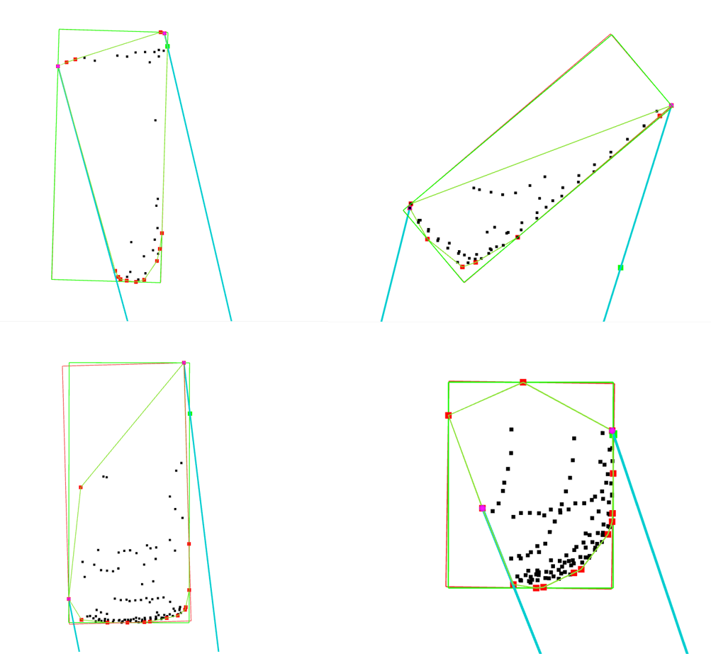

## Convex hull based bounding box fitting for 3D LiDAR Point Clouds
An ROS implementation of "An Efficient Convex Hull-Based Vehicle Pose Estimation Method for 3D LiDAR"





## Features
* This method is faster comparing to the vanilla L-shape fitting algorithm
* It can achieve accurate vehicle pose estimation in most cases.

**Known Issues**
* In some cases, this method can not get the right vehicle pose.

## Environment
* Ubuntu 18.04/20.04
* ROS melodic/noetic

## Preparing the dataset
- Download the processed kitti dataset from https://drive.google.com/file/d/1sEsicSuYgImZmh_mg5JCbphG9JuTk7Cz/view?usp=sharing


## How to use
    # clone the repo
    mkdir -p catkin_ws/src
    cd catkin_ws/src
    git clone https://github.com/HMX2013/kitti3d_gt_loader
    git clone https://github.com/HMX2013/Covex-hull-based-fitting-3D-LiDAR-ROS

    download obsdet_msgs from
    "https://drive.google.com/file/d/1ztLk9Slm656CV-WJieUpBJPlz-Iw14Bk/view?usp=share_link"

    download the processed KITTI dataset from
    https://drive.google.com/file/d/1sEsicSuYgImZmh_mg5JCbphG9JuTk7Cz/view?usp=share_link

    cd ../
    catkin_make

    source ./devel/setup.bash
    roslaunch kitti3d run.launch
    roslaunch convex_optimize_fitting run_rviz.launch

## Citation
If our research has been helpful, please cite the below papers:

```
@article{ding2023efficient,
  title={An Efficient Convex Hull-Based Vehicle Pose Estimation Method for 3D LiDAR},
  author={Ding, Ningning},
  journal={arXiv preprint arXiv:2302.01034},
  year={2023}
}
```

## Contribution
You are welcome contributing to the package by opening a pull-request

We are following: 
[Google C++ Style Guide](https://google.github.io/styleguide/cppguide.html), 
[C++ Core Guidelines](https://isocpp.github.io/CppCoreGuidelines/CppCoreGuidelines#main), 
and [ROS C++ Style Guide](http://wiki.ros.org/CppStyleGuide)

## License
MIT License